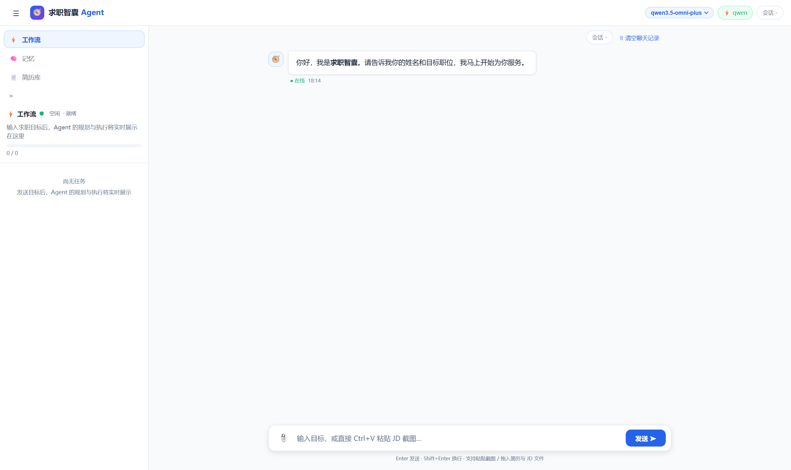
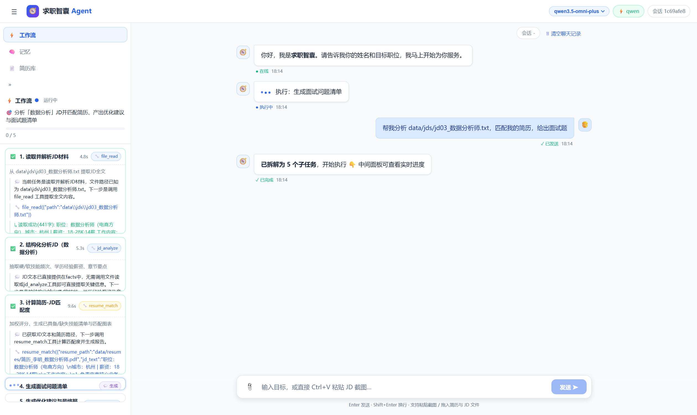
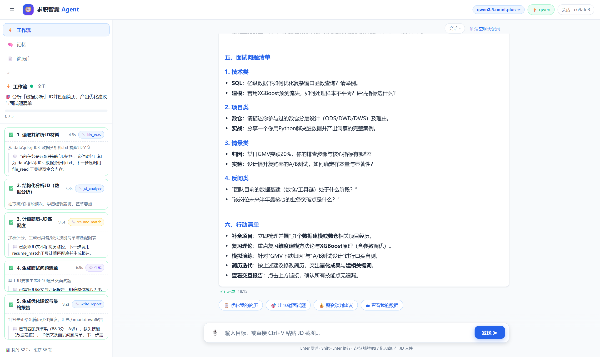
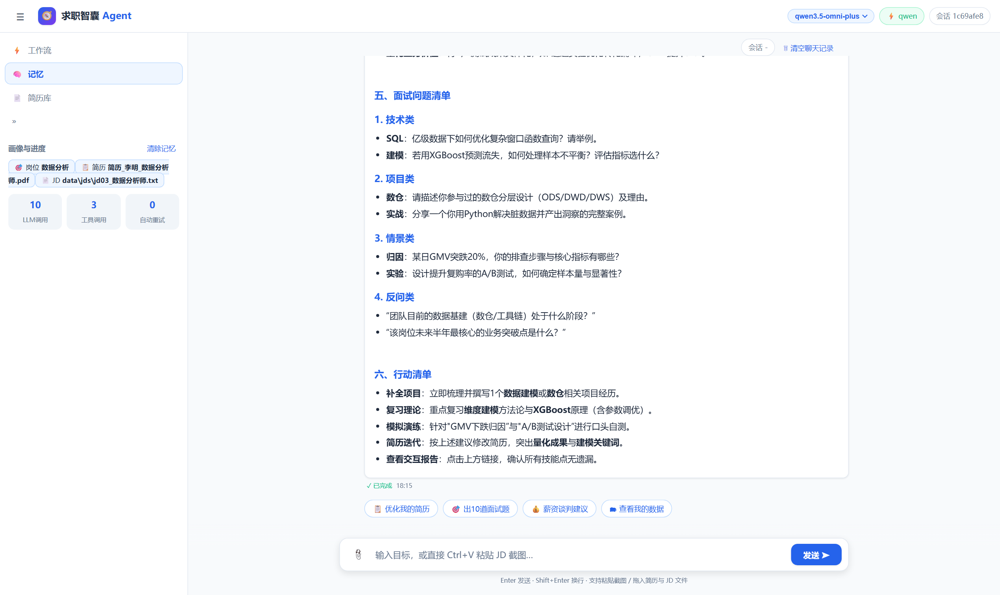

# 求职智囊 Agent

> 📖 **使用教程见 [TUTORIAL.md](TUTORIAL.md)**（界面导览 / 五大场景实战 / 指令 / FAQ）

一个能**自主拆解任务、调用工具、完成多步骤工作流**的 AI 求职助手。支持粘贴 JD 截图（OCR 识别）、管理多份简历，输入目标岗位 → 自动分析 JD → 匹配简历 → 生成优化建议 → 产出面试问题清单，全过程在 Web 界面上实时可视化。

## 求职智囊人设

Agent 内置「求职智囊」人设（`core/prompts.py` 的 PERSONA_RULES，注入所有 LLM 调用）：专业、温暖、直接；短句直答、无寒暄、默认简洁（报告类除外）；需求模糊最多追问一个关键问题；不编造任何职位/公司/数据。

已落地的人设行为（代码级，离线可测）：

- **欢迎语**：新会话首次打开界面自动问候（≤30字），引导提供姓名与目标职位；
- **画像记忆**：自动识别并持续记住 姓名/目标岗位/城市/薪资/学历/经验/远程偏好/JD与简历文件，侧栏「Agent 记忆」实时可见，后续对话自动引用；
- **敏感信息拦截**：消息中出现身份证号/银行卡号/密码验证码 → 立即提示并忽略，**不落盘、不进记忆、不跑流水线**；
- **数据控制权**：发送「查看我的数据」查看画像摘要；「删除我的所有记忆」立即清除并确认（本地即时响应，不耗 LLM 调用）；
- **快捷操作**：报告结束后自动附「优化我的简历 / 出10道面试题 / 薪资谈判建议 / 查看我的数据」按钮，一键发送；
- **流式体验**：长报告打字机渐进渲染，工作流事件全程直播。

路线图（人设要求中尚未自动化的部分）：投递后7天自动提醒跟进邮件、基于行为反馈的动态推荐画像、相似背景成功案例库。

## 工程化能力

- **智能缓存复用**：JD/简历/PDF/截图的解析与匹配结果按内容哈希落盘缓存（`data/cache/`），材料未变化直接复用，重复分析 0 成本（工具记录显示"磁盘缓存"）；
- **成本感知**：每个工具标注成本等级（低/中/高）与预估耗时，规划器提示词引导优先低成本工具，任务卡徽章按成本着色，结束后统计高成本调用次数与总耗时；
- **模型降级**：主模型连续失败自动切换 `LLM_FALLBACK_MODEL` 备用模型，界面提示降级状态；
- **隐私加密**：会话/简历/截图/上传材料落盘即加密（Fernet，密钥 `DATA_KEY` 环境变量或自动生成的 `data/.key`），兼容旧明文文件；
- **OCR 后处理**：领域错别字词典纠错（"数据分折"→"数据分析"等）；
- **事实时效**：30 天未更新的记忆项在「查看我的数据」中标记"待确认"；
- **对抗性测试**：冒烟测试包含错别字+干扰信息的 JD 样本；CI 自动跑测试与密钥泄露扫描。

## 路线图（按价值排序，可直接作为迭代需求）

| 模块 | 项 | 说明 |
|---|---|---|
| 任务执行 | 断点续跑 | 任务卡片上暂停/终止，从中间任务恢复（ask_user 挂起恢复已具备，需扩展 UI 按钮） |
| 记忆 | 多简历画像 | 每份简历建独立技能标签，匹配时自动选最合适的一份 |
| 记忆 | 行为图谱 | 记录求职阶段/活跃度/简历迭代频率，动态调整推荐 |
| 报告 | 模板切换 | 简洁版/详细版/HR视角版，快捷操作选择 |
| 报告 | 行动项跟踪 | 行动清单可勾选，跨会话提醒未完成项 |
| 报告 | 多岗位合并对比 | 横向对比表：匹配分/优势/共同缺失，辅助投递决策 |
| 简历 | 版本差异对比 | 新旧简历 diff，标注分数变化原因 |
| 简历 | PyMuPDF 解析 | 复杂版式（多栏/图片型PDF）与人工校准界面 |
| 交互 | 语音输入 | 语音命令（"分析上一条JD"） |
| 运维 | 资源队列 | LLM/OCR 并发上限（环境变量配置），多用户防资源耗尽 |
| 隐私 | 无痕会话 | 该模式不落盘不记忆 |
| 评测 | 反馈闭环 | 报告评分按钮，数据用于微调匹配权重 |

## 系统运行截图

> 截图由 `scripts/capture_screenshots.py` 用 Playwright 自动操作**真实运行中的页面**生成（非设计稿）：
> `python server.py` → 打开 `http://127.0.0.1:8000` → 发送目标「帮我分析 data/jds/jd03_数据分析师.txt，匹配我的简历，给出面试题」
> → 自动等待工作流跑完并截图。复现：
> ```bash
> pip install playwright && playwright install chromium
> python server.py                     # 另开一个终端
> python scripts/capture_screenshots.py
> ```

### 1. 主界面

左侧是可切换的「工作流 / 记忆 / 简历库」抽屉，右侧是对话区，顶部可切换模型与会话；
新会话会收到 Agent 的欢迎语，引导提供姓名与目标岗位。



### 2. 运行过程（规划 → 工具调用 → 报告）

右侧工作流面板实时直播：目标拆解进度（0/5）、每个子任务卡片、每步的**思考💭 → 工具调用🔧 → 观察结果**、
耗时徽章与重试标记。可以清楚看到 `file_read` → `jd_analyze` → `resume_match` 的产物自动接线过程。



### 3. 运行结果（最终报告 + 完成态工作流）

五个子任务全部完成，左侧渲染 markdown 报告（面试问题清单、行动清单），
底部自动附「优化我的简历 / 出10道面试题 / 薪资谈判建议 / 查看我的数据」快捷操作。



### 4. Agent 记忆面板

跨会话画像（岗位/简历/城市/JD 文件等结构化事实）与本次运行的统计（LLM 调用数、工具调用数、自动重试次数）。



> 说明：原 README 此处引用的 `data/reports/charts/batch_overview.png` 因 `data/reports/` 已被 `.gitignore`
> 排除（报告含简历个人信息），在 GitHub 上无法显示，故替换为上面随仓库提交的运行截图。
> 批量评测总览图可在本地运行 `python tests/batch_eval.py` 重新生成。

## 功能总览

| 需求 | 实现 |
|---|---|
| **任务规划模块** | `core/planner.py`：LLM 把目标拆解为带依赖关系的子任务 JSON（含校验与兜底模板规划）；执行中材料变化可**动态重新规划**（replan） |
| **工具调用（9个）** | `web_search`（Search-primary→Search-fallback 兜底链）、`web_fetch`（网页抓取）、`pdf_extract`、`docx_extract`（Word简历）、`image_ocr`（JD截图识别，rapidocr）、`file_read`、`jd_analyze`（jieba+pandas 技能词频/学历/薪资/章节结构化）、`resume_match`（加权评分+matplotlib 图表）、`write_report` |
| **多轮对话与记忆** | 会话持久化、结构化事实记忆（岗位/城市/文件/偏好）、滚动摘要压缩；信息不足时 **ask_user 暂停→追问→恢复** |
| **截图粘贴识别JD** | 对话框直接 **Ctrl+V 粘贴截图**（或拖入图片）→ 本地 OCR → 自动进入 JD 分析流程，无需手动打字 |
| **简历库管理** | 右上角「简历库」面板：**拖拽/点击上传**多份简历（pdf/docx/txt/md）、一键切换「使用中」的简历、删除；选中的简历随消息生效，未选择时自动用最新上传的一份 |
| **工作流可视化** | 任务卡片实时展示规划→思考💭→工具调用→结果，进度条、重试徽章🔁、失败❌、等待⏸；左侧渲染最终 markdown 报告与匹配图表 |
| **错误处理与重试** | LLM 指数退避重试×3 + JSON 输出解析失败自动修复×2；工具统一重试×2；单任务连续失败熔断；依赖失败自动传播；执行器可宣告 `fail` 降级。故障注入测试见 `tests/test_smoke.py` 第7节 |
| **真实数据测试** | `tests/batch_eval.py`：10 个真实风格 JD 全链路自动跑批 → `data/reports/batch_report.md` + 10 份独立报告 + 10 张匹配图表 + 汇总CSV/总览图 |

## 架构

```
用户消息/截图/简历文件
        │
        ▼
JobAgent 编排器 (core/agent.py)
 ├─ ① 记忆更新：正则+LLM 抽取事实（岗位/城市/文件）→ Session.facts
 ├─ ② 任务规划：LLM 规划(JSON校验) / 兜底模板规划 ──> 事件 plan_created
 ├─ ③ 逐任务 ReAct 执行
 │      思考 → 选工具 → registry.call（重试/退避）→ 观察 → …
 │      工具产物自动接线（OCR/PDF/文本 → jd_analyze → resume_match → 报告）
 │      ask_user → 会话挂起，用户回复后自动恢复（重新规划）
 ├─ ④ 综合报告 → markdown 落盘 data/reports/
 └─ 全程 EventBus ──> FastAPI SSE ──> 前端工作流实时渲染
```

技术栈：Python 3.10+ / FastAPI + SSE / OpenAI 兼容 SDK（通用端点、generic-llm、Generic、通用端点通用、OpenAI…）/ rapidocr(截图识别) + pdfplumber + python-docx / jieba + pandas + matplotlib / 原生 JS 前端（零构建）。

## 快速开始

```bash
pip install -r requirements.txt

# 配置 LLM（不配置则自动进入 mock 演示模式）
cp .env.example .env        # 然后填入你的 API key（.env 不会被提交）

python server.py            # 打开 http://127.0.0.1:8000
```

基本玩法：

1. **粘贴 JD 截图**：任意界面截图后直接 Ctrl+V 到输入框，自动 OCR 并开始分析；
2. **上传简历**：右上角「简历库」→ 拖入或点击上传 → 点「使用」；也可以把简历文件直接拖进对话框；
3. **发送目标**：如「分析这份JD并匹配简历，给出面试题」，右侧实时观看 Agent 规划与执行；
4. 报告与图表落盘 `data/reports/`，会话记忆在 `data/sessions/`。

命令行方式：

```bash
python main.py "帮我分析 data/jds/jd03_数据分析师.txt，匹配简历并给面试题"   # 单轮
python main.py                                                              # 交互
python tests/test_smoke.py     # 39项冒烟测试（含OCR/docx与故障注入）
python tests/batch_eval.py     # 10个JD批量评测
```

## 部署上线

**方式一：裸机/云服务器**

```bash
pip install -r requirements.txt
uvicorn server:app --host 0.0.0.0 --port 8000
```

建议用 systemd/supervisor 守护进程；生产环境在服务前挂 Nginx 做 TLS 与静态缓存。

**方式二：Docker**

```bash
docker build -t ai-job-agent .
docker run -d -p 8000:8000 --env-file .env -v ./data:/app/data ai-job-agent
```

`-v ./data:/app/data` 把简历库、会话与报告持久化到宿主机。

> 安全提醒：`.env`（含 key）已被 `.gitignore` 与 `.dockerignore` 双重排除，不会进入镜像与仓库。

## GitHub 整理清单

- `.env` 含真实 key，已被 `.gitignore` 排除；仓库里只有占位模板 `.env.example`；
- `data/sessions/`、`data/uploads/`（用户简历与对话，涉隐私）同样被排除；
- `data/reports/` 保留批量评测产物作为效果展示；
- 首次发布：
  ```bash
  git init && git add -A
  git status   # 确认没有 .env / data/uploads / data/sessions
  git commit -m "feat: AI求职助手Agent v1"
  git remote add origin <你的仓库地址> && git push -u origin main
  ```

## 演示视频脚本建议（3-5分钟）

1. **开场（15s）**：README 页 + 架构图，一句话定位"输入目标岗位，Agent 自动完成 JD 分析→简历匹配→面试准备"；
2. **截图识别（40s）**：打开招聘网站 JD → 截图 → 对话框 Ctrl+V → 展示 OCR 提示与自动开始分析；
3. **工作流可视化（60s）**：镜头对准右侧面板，讲解任务卡片：规划 5 个子任务、每个任务的思考与工具调用、resume_match 出分与图表；
4. **简历库（40s）**：拖入两份简历 → 切换「使用中」→ 重跑匹配，分数变化证明简历选择生效；
5. **多轮追问（30s）**：新会话只说"我想找数据分析工作"→ Agent 追问 → 补充材料 → 自动重新规划完成；
6. **批量评测收尾（30s）**：展示 `data/reports/batch_report.md` 总览图与梯度结论，突出工程化（重试/降级/测试覆盖）。

## 评测结果（10 真实JD × 样例「数据分析师」简历）

| 岗位 | 匹配分 | 等级 | 缺失技能示例 |
|---|---|---|---|
| 用户增长运营 | 95.0 | A | — |
| 数据分析师 | 88.3 | A | 数据建模 |
| 数据产品经理 | 80.9 | A | 数据建模 |
| AI产品经理(大模型) | 76.6 | B | Prompt工程、RAG |
| 测试开发 | 73.3 | B | 大模型评测 |
| 大模型应用工程师 | 72.0 | B | Agent开发、向量库 |
| 算法工程师(NLP) | 70.4 | B | PyTorch、深度学习 |
| 机器学习(推荐) | 51.2 | C | 推荐系统、Spark |
| 后端开发(Go) | 43.3 | C | Go、K8s、Kafka |
| 前端开发(React) | 30.0 | D | React、TS、可视化 |

匹配分在数据类（80+）与硬核技术研发类（30-50）之间呈清晰梯度，验证了加权评分的区分度。每份报告含：JD 解读、匹配度图表、差距清单、可执行优化建议、8-10 道分类面试题、行动清单。

## 目录结构

```
├── server.py            # FastAPI 服务：SSE事件流 + 简历库/OCR/上传 API
├── main.py              # CLI 入口（交互/单轮/--serve）
├── config.py            # LLM 配置自动探测与降级
├── core/                # agent编排 / planner规划 / llm客户端 / memory记忆 / prompts
├── tools/               # 9个工具（含 image_ocr 截图识别、docx_extract）+ 重试注册表
├── static/index.html    # 前端：对话 + 工作流可视化 + 简历库面板 + 截图粘贴
├── data/
│   ├── jds/             # 10个真实风格JD
│   ├── resumes/         # 简历库（用户上传）
│   ├── uploads/         # 临时材料（JD截图/文档）
│   └── reports/         # 批量评测报告与图表（含个人信息，不入库）
├── scripts/
│   └── capture_screenshots.py  # Playwright 自动操作界面并截图（README 截图来源）
├── screenshots/         # 系统运行截图
├── tests/               # 冒烟测试 + 批量评测
├── Dockerfile           # 容器化部署
└── .env.example         # 配置模板（占位，不含真实key）
```
